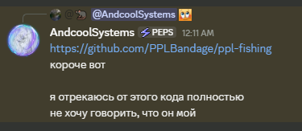

# Fishing Game

Полностью изолированная мини-игра рыбалки из проекта PPLBandage.

</img>

## Разработка

```bash
npm run dev
```

Приложение будет доступно по адресу `http://localhost:3000/fishing` (благодаря `basePath` в `next.config.mjs`).

## Сборка

```bash
npm run build
npm run start
```

## Особенности

- **Полностью автономен**: 0 внешних зависимостей кроме React/Next.js
- **Самодостаточный рендеринг**: все визуалы через Canvas 2D API
- **Процедурный звук**: Web Audio API вместо файлов
- **localStorage**: сохранение инвентаря и прогресса локально

## Структура

```
src/
├── app/
│   ├── layout.tsx          # Минимальный root layout
│   └── page.tsx            # Главная страница (src/app/fishing перенесена сюда)
├── components/
│   └── fishing/            # UI компоненты (FishingGame, Inventory, Popup)
├── lib/
│   └── fishing/            # Игровая логика (engine, renderer, physics, sounds, api)
└── styles/
    └── fishing/            # CSS модули
```

## Развертывание

Для production развертывания:

1. Соберите проект: `npm run build`
2. Запустите: `npm run start`
3. Приложение будет доступно по `/fishing`

Если нужно развернуть на другом домене или порту, настройте реверс-прокси (nginx/Apache) для маршрутизации `/fishing` к этому приложению.
